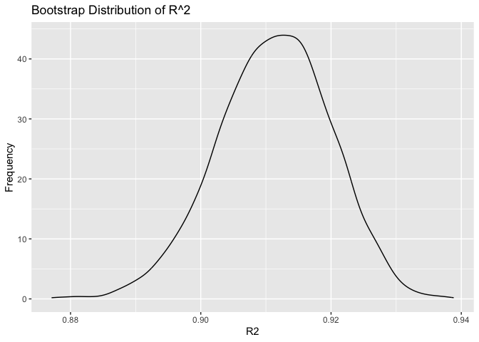
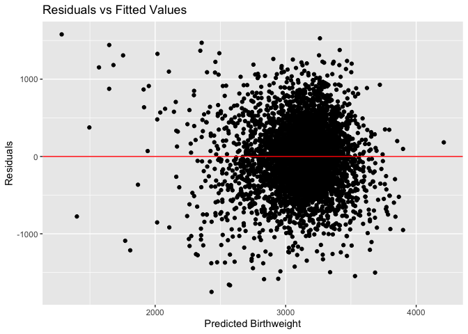
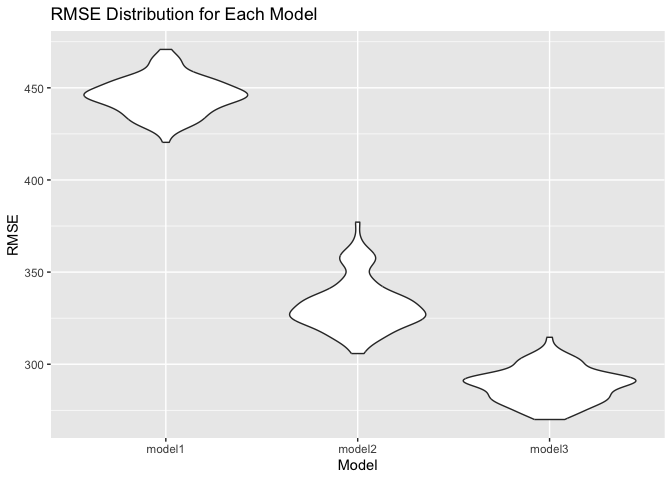

p8105_hw6_lmp2234
================
Lisa Pardee
2024-11-30

``` r
knitr::opts_chunk$set(echo = TRUE)
```

``` r
library(tidyverse)
```

    ## ── Attaching core tidyverse packages ──────────────────────── tidyverse 2.0.0 ──
    ## ✔ dplyr     1.1.4     ✔ readr     2.1.5
    ## ✔ forcats   1.0.0     ✔ stringr   1.5.1
    ## ✔ ggplot2   3.5.1     ✔ tibble    3.2.1
    ## ✔ lubridate 1.9.3     ✔ tidyr     1.3.1
    ## ✔ purrr     1.0.2     
    ## ── Conflicts ────────────────────────────────────────── tidyverse_conflicts() ──
    ## ✖ dplyr::filter() masks stats::filter()
    ## ✖ dplyr::lag()    masks stats::lag()
    ## ℹ Use the conflicted package (<http://conflicted.r-lib.org/>) to force all conflicts to become errors

``` r
library(modelr)
library(mgcv)
```

    ## Loading required package: nlme
    ## 
    ## Attaching package: 'nlme'
    ## 
    ## The following object is masked from 'package:dplyr':
    ## 
    ##     collapse
    ## 
    ## This is mgcv 1.9-1. For overview type 'help("mgcv-package")'.

``` r
library(SemiPar)
library(p8105.datasets)
library(purrr)
set.seed(1)
```

# Problem 1

``` r
weather_df = 
  rnoaa::meteo_pull_monitors(
    c("USW00094728"),
    var = c("PRCP", "TMIN", "TMAX"), 
    date_min = "2017-01-01",
    date_max = "2017-12-31") %>%
  mutate(
    name = recode(id, USW00094728 = "CentralPark_NY"),
    tmin = tmin / 10,
    tmax = tmax / 10) %>%
  select(name, id, everything())
```

    ## using cached file: /Users/lisapardee/Library/Caches/org.R-project.R/R/rnoaa/noaa_ghcnd/USW00094728.dly

    ## date created (size, mb): 2024-11-12 21:38:09.45139 (8.667)

    ## file min/max dates: 1869-01-01 / 2024-11-30

Bootstrapping

``` r
weather_boot_results =
 weather_df %>% 
  bootstrap(5000, id = "strap_number") %>% 
  mutate(
    models = map(.x = strap, ~lm(tmax ~ tmin, data = .x)),
    results = map(models, broom::tidy)
  ) %>%
  select(strap_number, results) %>%
  unnest(results) 
  
  weather_boot_results %>% 
  group_by(term) %>% 
  summarize(
    mean_est = mean(estimate), 
    sd_est = sd(estimate)
  )
```

    ## # A tibble: 2 × 3
    ##   term        mean_est sd_est
    ##   <chr>          <dbl>  <dbl>
    ## 1 (Intercept)     7.21 0.255 
    ## 2 tmin            1.04 0.0171

Extracting R^2 from the bootstrap model

``` r
weather_boot_results = 
  weather_df %>% 
  bootstrap(5000, id = "strap_number") %>% 
  mutate(
    models = map(.x = strap, ~lm(tmax ~ tmin, data = .x)),
    r2 = map_dbl(models, ~broom::glance(.x)$r.squared)
  )
```

Calculating log(Bo x B1)

``` r
weather_boot_results = weather_boot_results %>% 
  mutate(
    coefs = map(models, broom::tidy),
    log_beta_product = map_dbl(coefs, ~{
      coefs = .x
      beta0 = coefs$estimate[coefs$term == "(Intercept)"]
      beta1 = coefs$estimate[coefs$term == "tmin"]
      log(beta0 * beta1)
    })
  )
```

Mapping the distribution of each estimate

``` r
library(ggplot2)

ggplot(weather_boot_results, aes(x = r2))+
  geom_density()+
  labs(title = "Bootstrap Distribution of R^2", x = "R2", y = "Frequency")
```

<!-- -->

``` r
ggplot(weather_boot_results, aes (x = log_beta_product))+
  geom_density() +
  labs(title = "Boostrap Distribution of Log Beta Products", x = "Log Beta", y = "Frequency") 
```

<!-- -->

Calculating Confidence Intervals for Both

``` r
r2_ci = weather_boot_results %>%
  summarize(
    ci_lower = quantile(r2, 0.025),
    ci_upper = quantile(r2, 0.975)
  ) %>%
  mutate(term = "R^2")

r2_ci
```

    ## # A tibble: 1 × 3
    ##   ci_lower ci_upper term 
    ##      <dbl>    <dbl> <chr>
    ## 1    0.893    0.927 R^2

``` r
coef_ci = weather_boot_results %>% 
  unnest(coefs) %>% 
  group_by(term) %>% 
  summarize(
    ci_lower = quantile(estimate, 0.025),
    ci_upper = quantile(estimate, 0.975)
  )

coef_ci 
```

    ## # A tibble: 2 × 3
    ##   term        ci_lower ci_upper
    ##   <chr>          <dbl>    <dbl>
    ## 1 (Intercept)     6.73     7.71
    ## 2 tmin            1.01     1.07

``` r
boot_confidence_intervals = bind_rows(coef_ci, r2_ci)

boot_confidence_intervals
```

    ## # A tibble: 3 × 3
    ##   term        ci_lower ci_upper
    ##   <chr>          <dbl>    <dbl>
    ## 1 (Intercept)    6.73     7.71 
    ## 2 tmin           1.01     1.07 
    ## 3 R^2            0.893    0.927

# Problem 2

``` r
library(readr)

homocide_df = 
  read_csv("homicide_data.csv") %>% 
  mutate(
    city_state = paste(city, state, sep = ","), 
    solved = if_else(disposition == "Closed by arrest", 1, 0), 
    victim_age = as.numeric(victim_age)) %>% 
  filter(
    !city_state %in% c("Dallas,TX", "Phoenix,AZ", "Kansas City,MO", "Tulsa,AL"),
    victim_race %in% c("White", "Black"), 
    !is.na(victim_age)
  )
```

``` r
baltimore_fit = glm(solved ~ victim_age + victim_sex + victim_race, data = homocide_df, family = binomial())

coef(baltimore_fit)
```

    ##       (Intercept)        victim_age    victim_sexMale victim_sexUnknown 
    ##       0.357685418      -0.002157959      -0.506057830      -0.076946585 
    ##  victim_raceWhite 
    ##       0.606757334

``` r
baltimore_tidy = 
baltimore_fit |> 
  broom::tidy(conf.int = TRUE)  |> 
  select(term, estimate, conf.low, conf.high, p.value)

baltimore_tidy
```

    ## # A tibble: 5 × 5
    ##   term              estimate conf.low conf.high  p.value
    ##   <chr>                <dbl>    <dbl>     <dbl>    <dbl>
    ## 1 (Intercept)        0.358    0.286    0.429    1.15e-22
    ## 2 victim_age        -0.00216 -0.00359 -0.000728 3.11e- 3
    ## 3 victim_sexMale    -0.506   -0.564   -0.448    1.49e-65
    ## 4 victim_sexUnknown -0.0769  -0.695    0.556    8.08e- 1
    ## 5 victim_raceWhite   0.607    0.549    0.665    1.55e-93

``` r
male_female_odds = 
  baltimore_tidy %>% 
  filter(term=="victim_sexMale")

male_female_odds
```

    ## # A tibble: 1 × 5
    ##   term           estimate conf.low conf.high  p.value
    ##   <chr>             <dbl>    <dbl>     <dbl>    <dbl>
    ## 1 victim_sexMale   -0.506   -0.564    -0.448 1.49e-65

Running glms for each city

``` r
library(purrr)

city_regressions = 
  homocide_df %>% 
  group_by(city_state) %>% 
  nest() %>% 
  mutate(
    glm_fit = map(data, ~glm(solved ~ victim_age + victim_sex + victim_race, data = .x, family = binomial())),
    tidy_results = map(glm_fit, ~broom::tidy(.x, conf.int = TRUE, exponentiate = TRUE))
  ) %>% 
  unnest(tidy_results) %>% 
  filter(term == "victim_sexMale") %>%
  select(city_state, estimate, conf.low, conf.high, p.value) %>% 
  arrange(desc(estimate)) %>% 
    mutate(city_state = factor(city_state, levels = city_state))  
```

    ## Warning: There were 44 warnings in `mutate()`.
    ## The first warning was:
    ## ℹ In argument: `tidy_results = map(glm_fit, ~broom::tidy(.x, conf.int = TRUE,
    ##   exponentiate = TRUE))`.
    ## ℹ In group 1: `city_state = "Albuquerque,NM"`.
    ## Caused by warning:
    ## ! glm.fit: fitted probabilities numerically 0 or 1 occurred
    ## ℹ Run `dplyr::last_dplyr_warnings()` to see the 43 remaining warnings.

``` r
city_regressions
```

    ## # A tibble: 47 × 5
    ## # Groups:   city_state [47]
    ##    city_state       estimate conf.low conf.high p.value
    ##    <fct>               <dbl>    <dbl>     <dbl>   <dbl>
    ##  1 Albuquerque,NM      1.77     0.825      3.76   0.139
    ##  2 Stockton,CA         1.35     0.626      2.99   0.447
    ##  3 Fresno,CA           1.34     0.567      3.05   0.496
    ##  4 Nashville,TN        1.03     0.681      1.56   0.873
    ##  5 Richmond,VA         1.01     0.483      1.99   0.987
    ##  6 Atlanta,GA          1.00     0.680      1.46   1.00 
    ##  7 Tulsa,OK            0.976    0.609      1.54   0.917
    ##  8 Oklahoma City,OK    0.974    0.623      1.52   0.908
    ##  9 Minneapolis,MN      0.947    0.476      1.88   0.876
    ## 10 Indianapolis,IN     0.919    0.678      1.24   0.582
    ## # ℹ 37 more rows

``` r
city_regressions %>% 
  ggplot(aes(x = city_state, y = estimate)) +
  geom_point() +
  geom_errorbar(aes(ymin = conf.low, ymax = conf.high), width = 0.2) +
  labs( title = "Esimated ORs and CIs for Solving Homocides by City", x = "City", y = "Male to Female Victims Odds Ratio") +
  theme(axis.text.x = element_text(angle = 90, hjust = 1))
```

<!-- -->
This plot displays that cities such as Albuquerque, Freston, and
Stockton have higher odds ratios of male to female victims for solving
homicides.

\#Problem 3

``` r
birthweight_df = 
  read_csv("birthweight.csv") %>% 
  mutate(
    babysex = as.factor(babysex) ,
    frace = as.factor(frace) ,
    malform = as.factor(malform) ,
    mrace = as.factor(mrace)) %>% 
      drop_na()
```

    ## Rows: 4342 Columns: 20
    ## ── Column specification ────────────────────────────────────────────────────────
    ## Delimiter: ","
    ## dbl (20): babysex, bhead, blength, bwt, delwt, fincome, frace, gaweeks, malf...
    ## 
    ## ℹ Use `spec()` to retrieve the full column specification for this data.
    ## ℹ Specify the column types or set `show_col_types = FALSE` to quiet this message.

Looking at the data Fitting a model that includes factors such as
mother’s weigth at delivery (pounds),

``` r
birthweight_model <-
  lm(bwt ~ delwt + gaweeks + ppbmi + ppwt + delwt*gaweeks , data = birthweight_df)

summary(birthweight_model)
```

    ## 
    ## Call:
    ## lm(formula = bwt ~ delwt + gaweeks + ppbmi + ppwt + delwt * gaweeks, 
    ##     data = birthweight_df)
    ## 
    ## Residuals:
    ##      Min       1Q   Median       3Q      Max 
    ## -1752.04  -278.24     2.62   282.91  1579.18 
    ## 
    ## Coefficients:
    ##                 Estimate Std. Error t value Pr(>|t|)    
    ## (Intercept)   -3.026e+03  5.410e+02  -5.594 2.35e-08 ***
    ## delwt          3.130e+01  3.777e+00   8.286  < 2e-16 ***
    ## gaweeks        1.396e+02  1.363e+01  10.237  < 2e-16 ***
    ## ppbmi         -2.660e+01  4.077e+00  -6.522 7.71e-11 ***
    ## ppwt          -1.200e+00  9.095e-01  -1.319    0.187    
    ## delwt:gaweeks -5.561e-01  9.403e-02  -5.914 3.61e-09 ***
    ## ---
    ## Signif. codes:  0 '***' 0.001 '**' 0.01 '*' 0.05 '.' 0.1 ' ' 1
    ## 
    ## Residual standard error: 443.8 on 4336 degrees of freedom
    ## Multiple R-squared:   0.25,  Adjusted R-squared:  0.2491 
    ## F-statistic:   289 on 5 and 4336 DF,  p-value: < 2.2e-16

Residuals and Predictions

``` r
birthweight_df <- birthweight_df %>% 
  add_predictions(birthweight_model, var = "pred_bwt") %>% 
  add_residuals(birthweight_model, var = "residuals")

library(ggplot2)
ggplot(birthweight_df, aes(x=pred_bwt, y = residuals)) +
  geom_point() + 
  geom_hline(yintercept = 0, color = "red")+
  labs(title = "Residuals vs Fitted Values", x = "Predicted Birthweight", y = "Residuals") 
```

<!-- -->

Fitting the regression for a model of length at birth and gestational
age as predictors

``` r
birthweight_df |> 
  lm(bwt ~ blength + gaweeks, data = _) |> 
  broom::tidy()  |> 
  knitr::kable()
```

| term        |    estimate | std.error | statistic | p.value |
|:------------|------------:|----------:|----------:|--------:|
| (Intercept) | -4347.66707 | 97.958360 | -44.38281 |       0 |
| blength     |   128.55569 |  1.989891 |  64.60439 |       0 |
| gaweeks     |    27.04673 |  1.717930 |  15.74379 |       0 |

Fitting a regression model for head circumference, length, sex, and
interactions

``` r
birthweight_df |> 
  lm(bwt ~ bhead + blength + babysex + bhead*blength*babysex + bhead*blength + bhead*babysex + blength*babysex, data = _) |> 
  broom::tidy()  |> 
  knitr::kable(digits = 4)
```

| term                   |   estimate | std.error | statistic | p.value |
|:-----------------------|-----------:|----------:|----------:|--------:|
| (Intercept)            | -7176.8170 | 1264.8397 |   -5.6741 |  0.0000 |
| bhead                  |   181.7956 |   38.0542 |    4.7773 |  0.0000 |
| blength                |   102.1269 |   26.2118 |    3.8962 |  0.0001 |
| babysex2               |  6374.8684 | 1677.7669 |    3.7996 |  0.0001 |
| bhead:blength          |    -0.5536 |    0.7802 |   -0.7096 |  0.4780 |
| bhead:babysex2         |  -198.3932 |   51.0917 |   -3.8831 |  0.0001 |
| blength:babysex2       |  -123.7729 |   35.1185 |   -3.5244 |  0.0004 |
| bhead:blength:babysex2 |     3.8781 |    1.0566 |    3.6702 |  0.0002 |

Cross-Validation

``` r
set.seed(1)

cv_df <- crossv_mc(birthweight_df, n = 100)|> 
  mutate(
    train = map(train, as_tibble),
    test = map(test, as_tibble)
  )
```

Fitting Models & Extracting RMSEs

``` r
cv_df <- cv_df %>% 
  mutate(
    model1 = map(train, ~ lm(bwt ~ delwt + gaweeks + ppbmi + ppwt + delwt * gaweeks, data = .)),
    model2 = map(train, ~ lm(bwt ~ blength + gaweeks, data = .)),
    model3 = map(train, ~ lm(bwt ~ bhead + blength + babysex + bhead*blength*babysex + bhead*blength + bhead*babysex + blength*babysex, data = .))
  ) |> 
    mutate(
    rmse_model1 = map2_dbl(.x = model1, .y = test, ~ rmse(model = .x, data = .y)),
    rmse_model2 = map2_dbl(.x = model2, .y = test, ~ rmse(model = .x, data = .y)),
    rmse_model3 = map2_dbl(.x = model3, .y = test, ~ rmse(model = .x, data = .y))
  )
```

``` r
cv_df %>% 
  select(starts_with("rmse")) %>% 
  pivot_longer(
    everything(), 
    names_to = "model", 
    values_to = "rmse", 
    names_prefix = "rmse_"
  ) %>% 
  ggplot(aes(x = model, y = rmse)) + 
  geom_violin() +
  labs(title = "RMSE Distribution for Each Model", x = "Model", y = "RMSE")
```

<!-- -->
Compared to the other models, my model has the worst prediction accuracy
while model 3 has the most accurate prediction accuracy since the RMSE
is lower.
