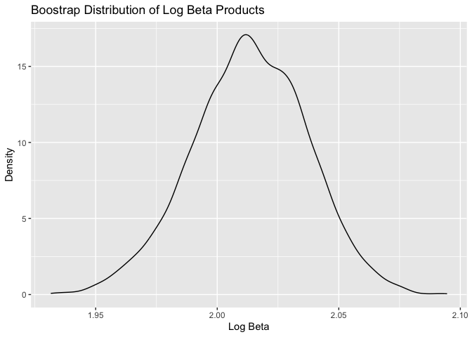
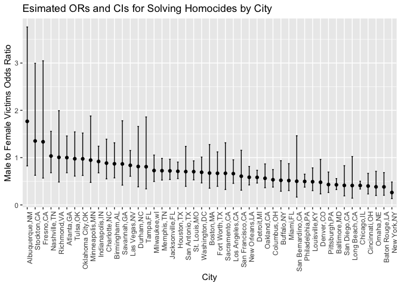
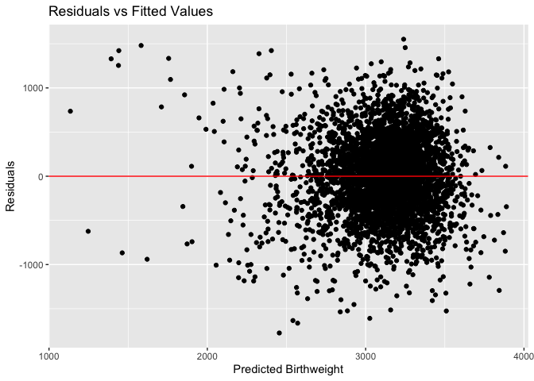

p8105_hw6_lmp2234
================
Lisa Pardee
2024-11-30

# Problem 1

``` r
weather_df = 
  rnoaa::meteo_pull_monitors(
    c("USW00094728"),
    var = c("PRCP", "TMIN", "TMAX"), 
    date_min = "2017-01-01",
    date_max = "2017-12-31") %>%
  mutate(
    name = recode(id, USW00094728 = "CentralPark_NY"),
    tmin = tmin / 10,
    tmax = tmax / 10) %>%
  select(name, id, everything())
```

Bootstrapping

``` r
weather_boot_results =
 weather_df %>% 
  bootstrap(5000, id = "strap_number") %>% 
  mutate(
    models = map(.x = strap, ~lm(tmax ~ tmin, data = .x)),
    results = map(models, broom::tidy)
  ) %>%
  select(strap_number, results) %>%
  unnest(results) 
  
  weather_boot_results %>% 
  group_by(term) %>% 
  summarize(
    mean_est = mean(estimate), 
    sd_est = sd(estimate)
  )
```

    ## # A tibble: 2 × 3
    ##   term        mean_est sd_est
    ##   <chr>          <dbl>  <dbl>
    ## 1 (Intercept)     7.21 0.255 
    ## 2 tmin            1.04 0.0171

Extracting R^2 from the bootstrap model

``` r
weather_boot_results = 
  weather_df %>% 
  bootstrap(5000, id = "strap_number") %>% 
  mutate(
    models = map(.x = strap, ~lm(tmax ~ tmin, data = .x)),
    r2 = map_dbl(models, ~broom::glance(.x)$r.squared)
  )

head(weather_boot_results)
```

    ## # A tibble: 6 × 4
    ##   strap                strap_number models    r2
    ##   <list>               <chr>        <list> <dbl>
    ## 1 <resample [365 x 6]> 0001         <lm>   0.914
    ## 2 <resample [365 x 6]> 0002         <lm>   0.911
    ## 3 <resample [365 x 6]> 0003         <lm>   0.925
    ## 4 <resample [365 x 6]> 0004         <lm>   0.905
    ## 5 <resample [365 x 6]> 0005         <lm>   0.922
    ## 6 <resample [365 x 6]> 0006         <lm>   0.906

Calculating log(Bo x B1)

``` r
weather_boot_results = weather_boot_results %>% 
  mutate(
    coefs = map(models, broom::tidy),
    log_beta_product = map_dbl(coefs, ~{
      coefs = .x
      beta0 = coefs$estimate[coefs$term == "(Intercept)"]
      beta1 = coefs$estimate[coefs$term == "tmin"]
      log(beta0 * beta1)
    })
  )

head(weather_boot_results)
```

    ## # A tibble: 6 × 6
    ##   strap                strap_number models    r2 coefs    log_beta_product
    ##   <list>               <chr>        <list> <dbl> <list>              <dbl>
    ## 1 <resample [365 x 6]> 0001         <lm>   0.914 <tibble>             2.00
    ## 2 <resample [365 x 6]> 0002         <lm>   0.911 <tibble>             2.00
    ## 3 <resample [365 x 6]> 0003         <lm>   0.925 <tibble>             1.99
    ## 4 <resample [365 x 6]> 0004         <lm>   0.905 <tibble>             2.00
    ## 5 <resample [365 x 6]> 0005         <lm>   0.922 <tibble>             1.99
    ## 6 <resample [365 x 6]> 0006         <lm>   0.906 <tibble>             2.05

Mapping the distribution of each estimate

``` r
library(ggplot2)

ggplot(weather_boot_results, aes(x = r2))+
  geom_density()+
  labs(title = "Bootstrap Distribution of R^2", x = "R2", y = "Density")
```

<!-- -->

``` r
ggplot(weather_boot_results, aes (x = log_beta_product))+
  geom_density() +
  labs(title = "Boostrap Distribution of Log Beta Products", x = "Log Beta", y = "Density") 
```

<!-- -->
The bootstrap distribution of R2 looks approximately normal with no
apparent shoulder or outliers. The bootstrap distribution of log(Bo x
B1) appears to hae a heavier tail extending to the right and a bit of
the shoulder which indicates the presence of outliers.

Calculating Confidence Intervals for R2 and log(𝛽̂ 0∗𝛽̂1 )

``` r
r2_ci = weather_boot_results %>%
  summarize(
    ci_lower = quantile(r2, 0.025),
    ci_upper = quantile(r2, 0.975)
  ) %>%
  mutate(term = "R^2")

r2_ci
```

    ## # A tibble: 1 × 3
    ##   ci_lower ci_upper term 
    ##      <dbl>    <dbl> <chr>
    ## 1    0.893    0.927 R^2

``` r
coef_ci = weather_boot_results %>% 
  unnest(coefs) %>% 
  group_by(term) %>% 
  summarize(
    ci_lower = quantile(estimate, 0.025),
    ci_upper = quantile(estimate, 0.975)
  )

coef_ci 
```

    ## # A tibble: 2 × 3
    ##   term        ci_lower ci_upper
    ##   <chr>          <dbl>    <dbl>
    ## 1 (Intercept)     6.73     7.71
    ## 2 tmin            1.01     1.07

``` r
boot_confidence_intervals = bind_rows(coef_ci, r2_ci)

boot_confidence_intervals
```

    ## # A tibble: 3 × 3
    ##   term        ci_lower ci_upper
    ##   <chr>          <dbl>    <dbl>
    ## 1 (Intercept)    6.73     7.71 
    ## 2 tmin           1.01     1.07 
    ## 3 R^2            0.893    0.927

# Problem 2

``` r
library(readr)

homocide_df = 
  read_csv("homicide_data.csv") %>% 
  mutate(
    city_state = paste(city, state, sep = ","), 
    solved = if_else(disposition == "Closed by arrest", 1, 0), 
    victim_age = as.numeric(victim_age)) %>% 
  filter(
    !city_state %in% c("Dallas,TX", "Phoenix,AZ", "Kansas City,MO", "Tulsa,AL"),
    victim_race %in% c("White", "Black"), 
    !is.na(victim_age)
  )
```

Fitting the model for the city of Baltimore, MD

``` r
baltimore_fit = glm(solved ~ victim_age + victim_sex + victim_race, data = homocide_df, family = binomial())

baltimore_tidy = 
baltimore_fit |> 
  broom::tidy(conf.int = TRUE) %>% 
  mutate(
    estimate = exp(estimate), 
    conf.low = exp(conf.low), 
    conf.high = exp(conf.high)) %>% 
  filter(term=="victim_sexMale") %>% 
  select(term, estimate, conf.low, conf.high, p.value)  
  

baltimore_tidy
```

    ## # A tibble: 1 × 5
    ##   term           estimate conf.low conf.high  p.value
    ##   <chr>             <dbl>    <dbl>     <dbl>    <dbl>
    ## 1 victim_sexMale    0.603    0.569     0.639 1.49e-65

Running glms for each city

``` r
library(purrr)

city_regressions = 
  homocide_df %>% 
  nest(data = -city_state) %>% 
  mutate(
    glm_fit = map(data, ~glm(solved ~ victim_age + victim_sex + victim_race, data = .x, family = binomial())),
    tidy_results = map(glm_fit, ~broom::tidy(.x, conf.int = TRUE, exponentiate = TRUE))
  ) %>% 
  unnest(tidy_results) %>% 
  filter(term == "victim_sexMale") %>%
  select(city_state, estimate, conf.low, conf.high, p.value) %>% 
    arrange(desc(estimate)) 
  
city_regressions
```

    ## # A tibble: 47 × 5
    ##    city_state       estimate conf.low conf.high p.value
    ##    <chr>               <dbl>    <dbl>     <dbl>   <dbl>
    ##  1 Albuquerque,NM      1.77     0.825      3.76   0.139
    ##  2 Stockton,CA         1.35     0.626      2.99   0.447
    ##  3 Fresno,CA           1.34     0.567      3.05   0.496
    ##  4 Nashville,TN        1.03     0.681      1.56   0.873
    ##  5 Richmond,VA         1.01     0.483      1.99   0.987
    ##  6 Atlanta,GA          1.00     0.680      1.46   1.00 
    ##  7 Tulsa,OK            0.976    0.609      1.54   0.917
    ##  8 Oklahoma City,OK    0.974    0.623      1.52   0.908
    ##  9 Minneapolis,MN      0.947    0.476      1.88   0.876
    ## 10 Indianapolis,IN     0.919    0.678      1.24   0.582
    ## # ℹ 37 more rows

``` r
city_regressions %>% 
  mutate(city_state = factor(city_state, levels = city_state))%>%
  ggplot(aes(x = city_state, y = estimate)) +
  geom_point() +
  geom_errorbar(aes(ymin = conf.low, ymax = conf.high), width = 0.2) +
  labs( title = "Esimated ORs and CIs for Solving Homocides by City", x = "City", y = "Male to Female Victims Odds Ratio") +
  theme(axis.text.x = element_text(angle = 90, hjust = 1))
```

<!-- -->
This plot displays that cities such as Albuquerque NM, Stockton CA, and
Fresno have higher adjusted odds ratios for solving homicides comparing
male to female victims. They also have the widest confidence intervals
as well. The cities with lower adjusted ORs include Omaha NE, Baton
Rouge LA, and New York NY which also have more narrow confidence
intervals.

# Problem 3

Cleaned the data and converted numeric to factor for variables that were
categorical. Checked for missing data with the appropriate functions but
did not find missing data for any of the variables.

``` r
birthweight_df = 
  read_csv("birthweight.csv") %>% 
  mutate(
    babysex = as.factor(babysex) ,
    frace = as.factor(frace) ,
    malform = as.factor(malform) ,
    mrace = as.factor(mrace)) %>% 
      drop_na()
```

    ## Rows: 4342 Columns: 20
    ## ── Column specification ────────────────────────────────────────────────────────
    ## Delimiter: ","
    ## dbl (20): babysex, bhead, blength, bwt, delwt, fincome, frace, gaweeks, malf...
    ## 
    ## ℹ Use `spec()` to retrieve the full column specification for this data.
    ## ℹ Specify the column types or set `show_col_types = FALSE` to quiet this message.

Proposing the regression model for birth weight

Fitting a model that includes factors such as mother’s weight at
delivery (pounds), gestational age in weeks, mother’s pre-pregnancy BMI,
and mother’s pre-pregnancy weight.These are all plausible biological
predictors of birth weight and it would be important to assess the
interactions between all 4 of these variables to understand how weight
factors of the mother influence an infant’s birth weight.

``` r
birthweight_model <-
  lm(bwt ~ delwt * gaweeks + delwt * ppbmi + delwt * ppwt + gaweeks * ppbmi + gaweeks * ppwt + ppbmi * ppwt, data = birthweight_df)

summary(birthweight_model)
```

    ## 
    ## Call:
    ## lm(formula = bwt ~ delwt * gaweeks + delwt * ppbmi + delwt * 
    ##     ppwt + gaweeks * ppbmi + gaweeks * ppwt + ppbmi * ppwt, data = birthweight_df)
    ## 
    ## Residuals:
    ##      Min       1Q   Median       3Q      Max 
    ## -1775.02  -278.45     6.73   282.06  1547.04 
    ## 
    ## Coefficients:
    ##                 Estimate Std. Error t value Pr(>|t|)    
    ## (Intercept)   -3.581e+03  6.400e+02  -5.596 2.33e-08 ***
    ## delwt          8.182e+01  7.971e+00  10.265  < 2e-16 ***
    ## gaweeks        1.288e+02  1.564e+01   8.239 2.28e-16 ***
    ## ppbmi          1.329e+02  5.593e+01   2.377   0.0175 *  
    ## ppwt          -7.696e+01  1.241e+01  -6.201 6.13e-10 ***
    ## delwt:gaweeks -1.648e+00  1.874e-01  -8.793  < 2e-16 ***
    ## delwt:ppbmi   -2.773e-01  2.045e-01  -1.356   0.1753    
    ## delwt:ppwt    -7.939e-03  2.378e-02  -0.334   0.7385    
    ## gaweeks:ppbmi -3.127e+00  1.378e+00  -2.268   0.0234 *  
    ## gaweeks:ppwt   1.914e+00  3.040e-01   6.297 3.34e-10 ***
    ## ppbmi:ppwt     6.563e-02  1.395e-01   0.471   0.6380    
    ## ---
    ## Signif. codes:  0 '***' 0.001 '**' 0.01 '*' 0.05 '.' 0.1 ' ' 1
    ## 
    ## Residual standard error: 440.3 on 4331 degrees of freedom
    ## Multiple R-squared:  0.2626, Adjusted R-squared:  0.2609 
    ## F-statistic: 154.2 on 10 and 4331 DF,  p-value: < 2.2e-16

After fitting the model of the main effects and interactions, it is
apparent that the interactions between delwt:ppt, ppbmi:ppwt, and
delwt:ppbmi are not statistically significant. However, using backwards
select, the interaction between delwt and ppwt is the first to be
eliminated as it has the largest p-value.

Refitting the model after removing the interaction term

``` r
birthweight_model <-
  lm(bwt ~ delwt * gaweeks + delwt * ppbmi + gaweeks * ppbmi + gaweeks * ppwt + ppbmi * ppwt, data = birthweight_df)
summary(birthweight_model)
```

    ## 
    ## Call:
    ## lm(formula = bwt ~ delwt * gaweeks + delwt * ppbmi + gaweeks * 
    ##     ppbmi + gaweeks * ppwt + ppbmi * ppwt, data = birthweight_df)
    ## 
    ## Residuals:
    ##      Min       1Q   Median       3Q      Max 
    ## -1774.37  -278.50     6.72   281.96  1547.56 
    ## 
    ## Coefficients:
    ##                 Estimate Std. Error t value Pr(>|t|)    
    ## (Intercept)   -3.602e+03  6.368e+02  -5.656 1.65e-08 ***
    ## delwt          8.198e+01  7.957e+00  10.303  < 2e-16 ***
    ## gaweeks        1.289e+02  1.563e+01   8.247  < 2e-16 ***
    ## ppbmi          1.375e+02  5.421e+01   2.537   0.0112 *  
    ## ppwt          -7.764e+01  1.224e+01  -6.343 2.49e-10 ***
    ## delwt:gaweeks -1.650e+00  1.873e-01  -8.807  < 2e-16 ***
    ## delwt:ppbmi   -3.266e-01  1.414e-01  -2.309   0.0210 *  
    ## gaweeks:ppbmi -3.051e+00  1.360e+00  -2.244   0.0249 *  
    ## gaweeks:ppwt   1.903e+00  3.019e-01   6.301 3.25e-10 ***
    ## ppbmi:ppwt     6.398e-02  1.394e-01   0.459   0.6463    
    ## ---
    ## Signif. codes:  0 '***' 0.001 '**' 0.01 '*' 0.05 '.' 0.1 ' ' 1
    ## 
    ## Residual standard error: 440.3 on 4332 degrees of freedom
    ## Multiple R-squared:  0.2626, Adjusted R-squared:  0.261 
    ## F-statistic: 171.4 on 9 and 4332 DF,  p-value: < 2.2e-16

Removing the interaction between ppbmi and ppwt. Now, all p-values for
each term in the model are significant.

``` r
birthweight_model <-
  lm(bwt ~ delwt * gaweeks + delwt * ppbmi + gaweeks * ppbmi + gaweeks * ppwt, data = birthweight_df)
summary(birthweight_model)
```

    ## 
    ## Call:
    ## lm(formula = bwt ~ delwt * gaweeks + delwt * ppbmi + gaweeks * 
    ##     ppbmi + gaweeks * ppwt, data = birthweight_df)
    ## 
    ## Residuals:
    ##      Min       1Q   Median       3Q      Max 
    ## -1774.64  -278.28     6.75   281.48  1551.18 
    ## 
    ## Coefficients:
    ##                 Estimate Std. Error t value Pr(>|t|)    
    ## (Intercept)   -3.600e+03  6.368e+02  -5.653 1.67e-08 ***
    ## delwt          8.080e+01  7.535e+00  10.723  < 2e-16 ***
    ## gaweeks        1.293e+02  1.561e+01   8.284  < 2e-16 ***
    ## ppbmi          1.376e+02  5.420e+01   2.538   0.0112 *  
    ## ppwt          -7.645e+01  1.196e+01  -6.391 1.82e-10 ***
    ## delwt:gaweeks -1.656e+00  1.869e-01  -8.858  < 2e-16 ***
    ## delwt:ppbmi   -2.661e-01  5.111e-02  -5.205 2.03e-07 ***
    ## gaweeks:ppbmi -3.072e+00  1.359e+00  -2.261   0.0238 *  
    ## gaweeks:ppwt   1.910e+00  3.014e-01   6.336 2.59e-10 ***
    ## ---
    ## Signif. codes:  0 '***' 0.001 '**' 0.01 '*' 0.05 '.' 0.1 ' ' 1
    ## 
    ## Residual standard error: 440.2 on 4333 degrees of freedom
    ## Multiple R-squared:  0.2625, Adjusted R-squared:  0.2612 
    ## F-statistic: 192.8 on 8 and 4333 DF,  p-value: < 2.2e-16

Residuals and Predictions

``` r
birthweight_df <- birthweight_df %>% 
  add_predictions(birthweight_model, var = "pred_bwt") %>% 
  add_residuals(birthweight_model, var = "residuals")

library(ggplot2)
ggplot(birthweight_df, aes(x=pred_bwt, y = residuals)) +
  geom_point() + 
  geom_hline(yintercept = 0, color = "red")+
  labs(title = "Residuals vs Fitted Values", x = "Predicted Birthweight", y = "Residuals") 
```

<!-- -->

Fitting the regression for a model of length at birth and gestational
age as predictors

``` r
birthweight_df |> 
  lm(bwt ~ blength + gaweeks, data = _) |> 
  broom::tidy()  |> 
  knitr::kable(digits = 4)
```

| term        |   estimate | std.error | statistic | p.value |
|:------------|-----------:|----------:|----------:|--------:|
| (Intercept) | -4347.6671 |   97.9584 |  -44.3828 |       0 |
| blength     |   128.5557 |    1.9899 |   64.6044 |       0 |
| gaweeks     |    27.0467 |    1.7179 |   15.7438 |       0 |

Fitting a regression model for head circumference, length, sex, and
interactions

``` r
birthweight_df |> 
  lm(bwt ~ bhead + blength + babysex + bhead*blength*babysex + bhead*blength + bhead*babysex + blength*babysex, data = _) |> 
  broom::tidy()  |> 
  knitr::kable(digits = 4)
```

| term                   |   estimate | std.error | statistic | p.value |
|:-----------------------|-----------:|----------:|----------:|--------:|
| (Intercept)            | -7176.8170 | 1264.8397 |   -5.6741 |  0.0000 |
| bhead                  |   181.7956 |   38.0542 |    4.7773 |  0.0000 |
| blength                |   102.1269 |   26.2118 |    3.8962 |  0.0001 |
| babysex2               |  6374.8684 | 1677.7669 |    3.7996 |  0.0001 |
| bhead:blength          |    -0.5536 |    0.7802 |   -0.7096 |  0.4780 |
| bhead:babysex2         |  -198.3932 |   51.0917 |   -3.8831 |  0.0001 |
| blength:babysex2       |  -123.7729 |   35.1185 |   -3.5244 |  0.0004 |
| bhead:blength:babysex2 |     3.8781 |    1.0566 |    3.6702 |  0.0002 |

Cross-Validation

``` r
set.seed(1)

cv_df <- crossv_mc(birthweight_df, n = 100)|> 
  mutate(
    train = map(train, as_tibble),
    test = map(test, as_tibble)
  )
```

Fitting Models & Extracting RMSEs. Model 1 is the proposed model. Model
2 is the length at birth and gestational age as predictors (main
effects). Model 3 is the model using head circumference, length, sex,
and all interactions between these

``` r
cv_df <- cv_df %>% 
  mutate(
    model1 = map(train, ~ lm(bwt ~ delwt * gaweeks + delwt * ppbmi + gaweeks * ppbmi + gaweeks * ppwt, data = birthweight_df)),
    model2 = map(train, ~ lm(bwt ~ blength + gaweeks, data = .)),
    model3 = map(train, ~ lm(bwt ~ bhead + blength + babysex + bhead*blength*babysex + bhead*blength + bhead*babysex + blength*babysex, data = .))
  ) |> 
    mutate(
    rmse_model1 = map2_dbl(.x = model1, .y = test, ~ rmse(model = .x, data = .y)),
    rmse_model2 = map2_dbl(.x = model2, .y = test, ~ rmse(model = .x, data = .y)),
    rmse_model3 = map2_dbl(.x = model3, .y = test, ~ rmse(model = .x, data = .y))
  )
```

``` r
cv_df %>% 
  select(starts_with("rmse")) %>% 
  pivot_longer(
    everything(), 
    names_to = "model", 
    values_to = "rmse", 
    names_prefix = "rmse_"
  ) %>% 
  ggplot(aes(x = model, y = rmse)) + 
  geom_violin() +
  labs(title = "RMSE Distribution for Each Model", x = "Model", y = "RMSE")
```

<!-- -->

Compared to the other models, model 1 (my proposed model) has the worst
prediction accuracy while model 3 (i.e., one using head circumference,
length, sex and all the interactions) has the most accurate prediction
accuracy as the RMSE is lower. Model 3 would be the most ideal choice
for birth weight.Although, model 2 is an improvement on my proposed
model the biggest improvement is in model 3.
